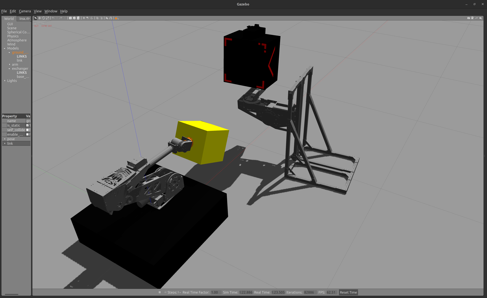
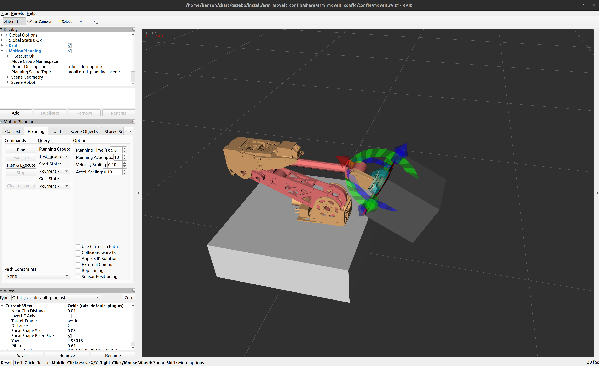
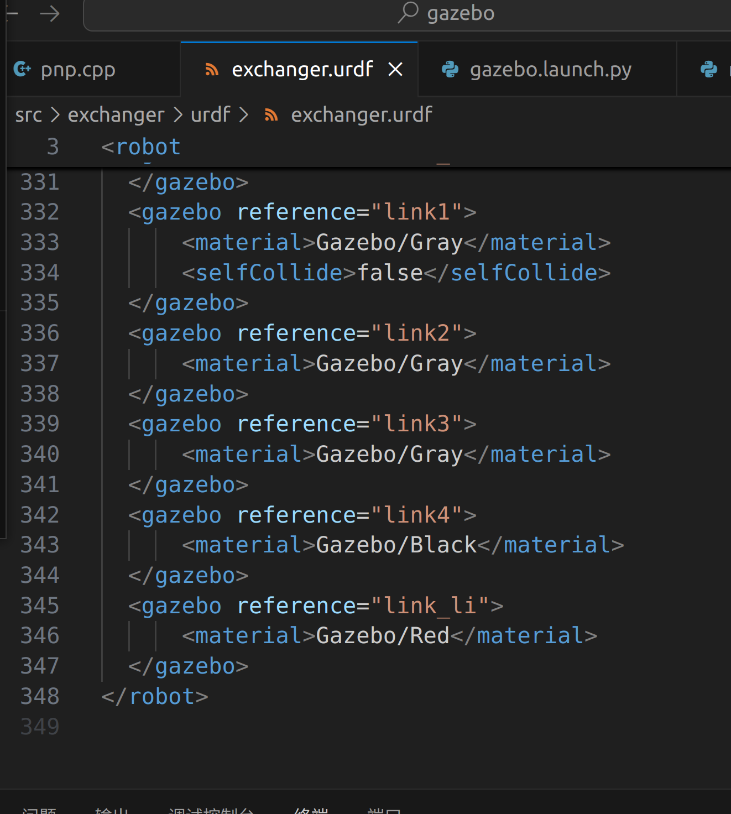
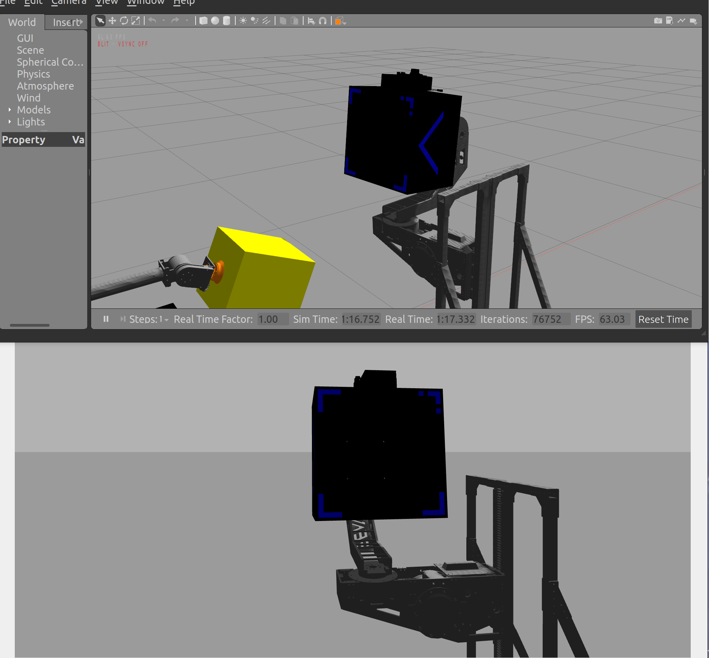
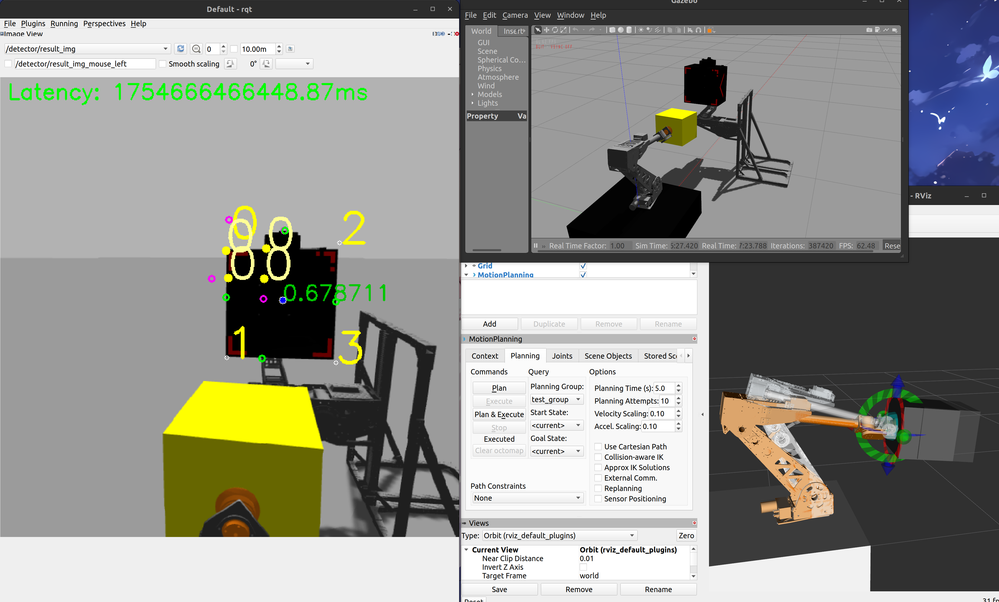
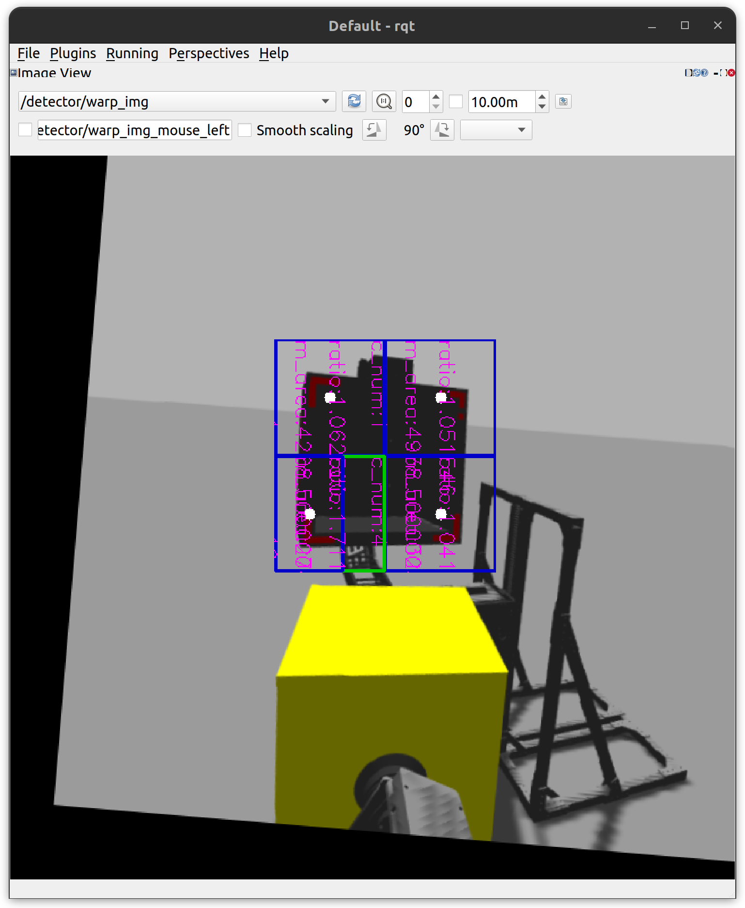
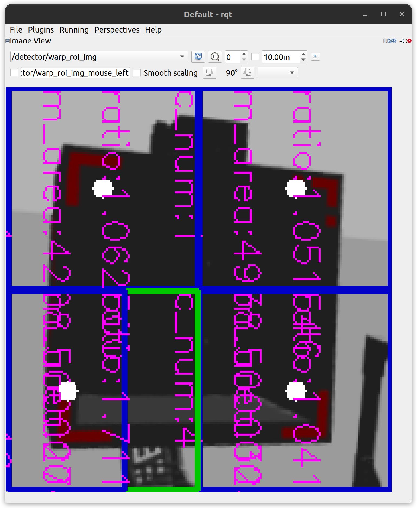
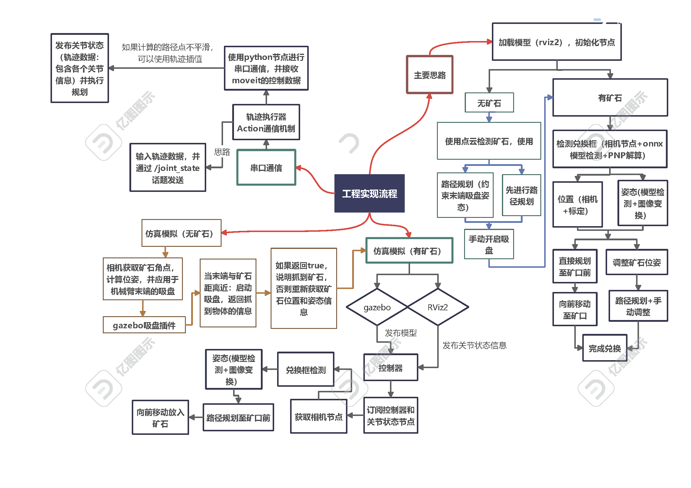

# This project is a example of gazebo joint with moveit2 (version:ROS2 humble)
# 本项目是Gazebo与moveit2（版本：ROS2 humble）结合的一个示例

>arm（机械臂）和exchanger（兑矿口）是两个不同的机械臂模型,由于exchanger（兑矿口）控制器没有做好，该部分无法被控制，只能先固定
（urdf和meshes文件已隐藏）
---
>The arm (robotic arm) and the exchanger (ore exchange port) are two different robotic arm models. Due to the poor design of the exchanger (ore exchange port) controller, this part cannot be controlled and can only be fixed temporarily
(URDF and meshes files are hidden)
### 以下是使用gazebo和rviz2实例，可以通过rviz2控制gazebo模型的运动（支持相机功能，有相机节点）
### Below is an example of using Gazebo and RViz2, where you can control the movement of the Gazebo model through RViz2 (with camera functionality supported, featuring a camera node)

### 可以在exchanger（兑矿口）模型中修改矿口的灯条颜色
### The color of the light bar at the ore port can be modified in the exchanger (ore port) model
>方式：把灯条当做一个固定的link，修改它的gazebo属性即可
>
>Method: Treat the light strip as a fixed link and modify its gazebo attribute

当link_li的gazebo颜色属性设置为Blue：

### 启动模型检测节点，可检测兑换框
### Start the model detection node to detect the exchange box

该图片是使用rqt 获取模型检测结果的话题，以下是其他话题内容

>该模型有问题，识别出错，主要说明的是检测可以使用。
>
>问题：在gazebo环境中，兑换框灯条显示不明显，可能影响模型识别

# 写在后面
# Write it at the back

项目问题：所有代码正在测试中，代码规范与可读性差且不整洁（比如：为了方便，部分代码直接使用绝对路径，未改正），一些小问题未能解决，比如节点名称重复，命名空间冲突，兼容性差。

项目用于学习
